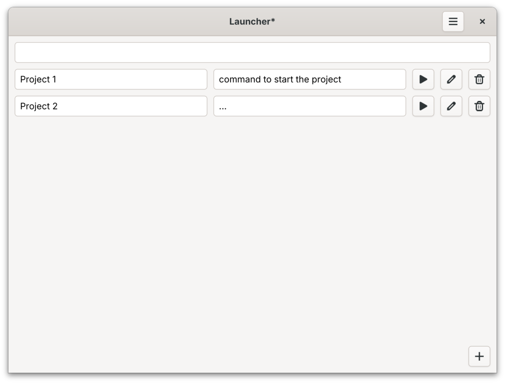

# Launcher

A simple project launcher for GNOME.



## Features

*   Add and manage a list of projects.
*   Launch projects.
*   Simple and intuitive interface.

## Installation

### From Source

#### Dependencies

*   Python 3
*   Meson
*   GTK4
*   `pygobject`

#### Building

```bash
meson setup _build
cd _build
ninja
sudo ninja install
```

## Running

You can run the application from your application menu or by running `launcher` from the command line.

## Contributing

Contributions are welcome! Please open an issue or submit a merge request.

## License

This project is licensed under the GPL-3.0-or-later. See the [COPYING](COPYING) file for details.
